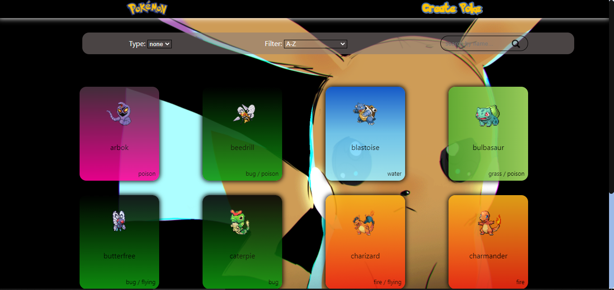
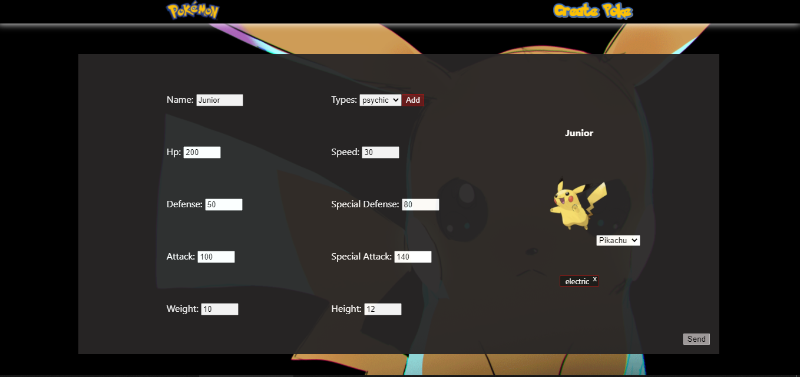
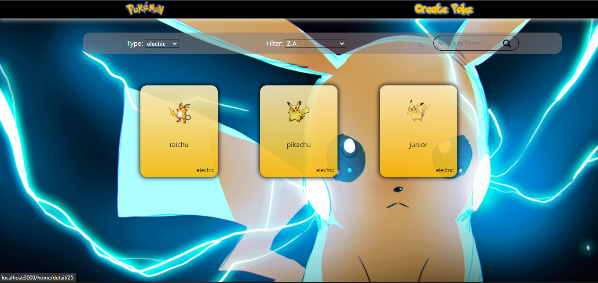
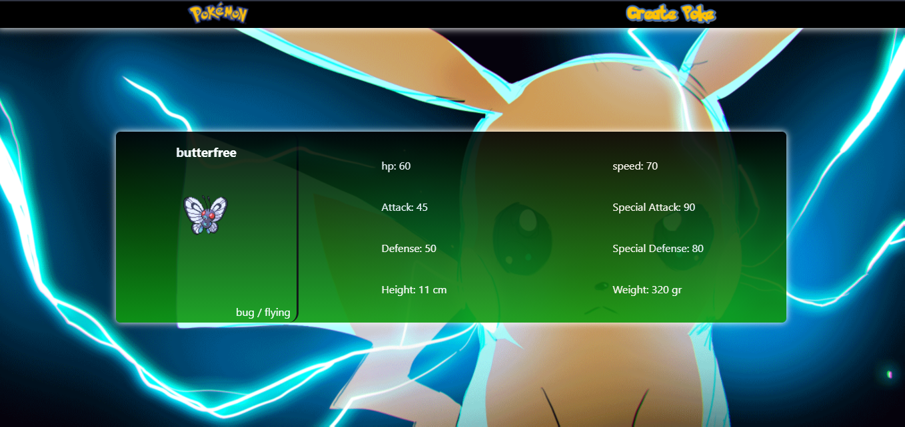

# PokeApp

  

Esta aplicación se alimenta de una API externa la cual brinda información del juego Pokémon.
Las tecnologias que se utilizo en el:  
-Front-End fueron, <b>React | Redux | CSS Modules.</b>  
-Back-End fueron, <b>Express | Sequelize | Postgres.</b> 

<h2><u>PokeApp cuenta con </u></h2>
 

Una Landing

 

Un Home 

 

Una vista donde el usuario podra crear sus propios pokemones

 

Ademas, en el Home el usuario podra encontrar una barra de filtrado

 

En esta vista se podran visualizar datos especificos de cada pokemon

